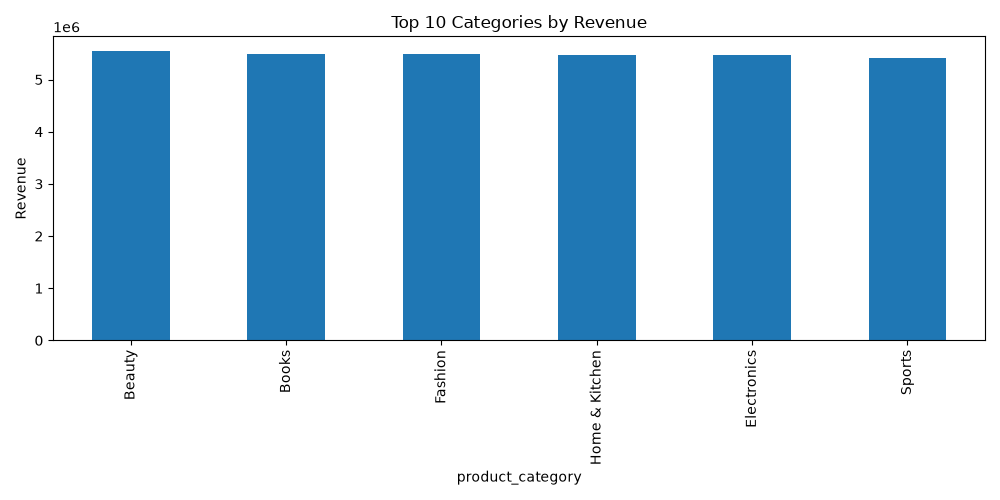

# Amazon Sales Analysis

## Project Overview

This project analyses 50,000 Amazon sales transactions using Python. The objective was to identify revenue trends, evaluate product category performance, analyse customer purchasing behaviour, and generate business insights through data visualisation.

## Tools Used

- Python
- Pandas
- Matplotlib
- VS Code

## Key Findings

- Generated £32.8M total revenue analysis
- Beauty category produced the highest revenue
- Middle East was the strongest performing region
- Average customer rating was 3.0/5
- Digital payments were the most popular transaction method

## Outputs

- Revenue analysis
- Category performance analysis
- Regional sales analysis
- Payment method analysis
- Data visualisations

## Dashboard / Visualisation

